**Kobla LEGBEDJE** – kobla.legbedje.etu@univ-lille.fr

**Luigi VUACHET** – luigi.vuachet.etu@univ-lille.fr
# **PROJET  Méthodes d’Apprentissage**

#**1.1 Introduction**
# Contexte du projet
Le cancer du sein est l'une des formes les plus courantes de cancer chez les femmes dans le monde. Une détection précoce joue un rôle essentiel dans l'amélioration des chances de survie et de guérison des patientes. Grâce aux progrès technologiques et à la disponibilité croissante des données médicales, les méthodes d’analyse basées sur l’intelligence artificielle (IA) et les algorithmes de classification sont devenues des outils incontournables pour assister les médecins dans le diagnostic. Ces outils permettent d’améliorer la précision des détections tout en réduisant le temps nécessaire à l’analyse des résultats.

Ce projet s’inscrit dans cette dynamique en exploitant des données médicales spécifiques, notamment des mesures liées aux tumeurs (telles que le rayon de la tumeur, la texture, le périmètre et l’aire), afin de déterminer si une tumeur est bénigne (B) ou maligne (M).

**Objectif de l'analyse**

L'objectif principal de notre étude est de développer un modèle de classification capable de prédire le diagnostic d'une tumeur à partir d’un ensemble de variables issues de mesures de tumeurs. Cette étude repose sur l’utilisation de plusieurs algorithmes de classification afin d’identifier celui offrant les meilleures performances.

Les étapes de notre projet incluent :

**1.2 Statistiques descriptives**

**1.3 Visualisation des données et corrélations**

**2 Algorithme de classification**

**2.1 Préparation des données**

**2.2 Implémentation des algorithmes**

**2.3 Analyse globale des performances**

**2.4 Conclusion**

# **Rapport du Projet : Classification des **Tumeurs****


```python
# wdbc.data
from math import *
import numpy as np
import matplotlib.pyplot as plt
import scipy.stats as stats
import pandas as pd
import seaborn as sns
import statsmodels.api as sm
from google.colab import drive
```


```python
drive.mount('/content/drive')
data=pd.read_csv('/content/drive/MyDrive/data/wdbc.data')
data.head()
```

    Mounted at /content/drive


  <div id="df-2fe98137-7106-4481-bccd-4693248135ca" class="colab-df-container">
    <div>
<style scoped>
    .dataframe tbody tr th:only-of-type {
        vertical-align: middle;
    }

    .dataframe tbody tr th {
        vertical-align: top;
    }

    .dataframe thead th {
        text-align: right;
    }
</style>
<table border="1" class="dataframe">
  <thead>
    <tr style="text-align: right;">
      <th></th>
      <th>842302</th>
      <th>M</th>
      <th>17.99</th>
      <th>10.38</th>
      <th>122.8</th>
      <th>1001</th>
      <th>0.1184</th>
      <th>0.2776</th>
      <th>0.3001</th>
      <th>0.1471</th>
      <th>...</th>
      <th>25.38</th>
      <th>17.33</th>
      <th>184.6</th>
      <th>2019</th>
      <th>0.1622</th>
      <th>0.6656</th>
      <th>0.7119</th>
      <th>0.2654</th>
      <th>0.4601</th>
      <th>0.1189</th>
    </tr>
  </thead>
  <tbody>
    <tr>
      <th>0</th>
      <td>842517</td>
      <td>M</td>
      <td>20.57</td>
      <td>17.77</td>
      <td>132.90</td>
      <td>1326.0</td>
      <td>0.08474</td>
      <td>0.07864</td>
      <td>0.0869</td>
      <td>0.07017</td>
      <td>...</td>
      <td>24.99</td>
      <td>23.41</td>
      <td>158.80</td>
      <td>1956.0</td>
      <td>0.1238</td>
      <td>0.1866</td>
      <td>0.2416</td>
      <td>0.1860</td>
      <td>0.2750</td>
      <td>0.08902</td>
    </tr>
    <tr>
      <th>1</th>
      <td>84300903</td>
      <td>M</td>
      <td>19.69</td>
      <td>21.25</td>
      <td>130.00</td>
      <td>1203.0</td>
      <td>0.10960</td>
      <td>0.15990</td>
      <td>0.1974</td>
      <td>0.12790</td>
      <td>...</td>
      <td>23.57</td>
      <td>25.53</td>
      <td>152.50</td>
      <td>1709.0</td>
      <td>0.1444</td>
      <td>0.4245</td>
      <td>0.4504</td>
      <td>0.2430</td>
      <td>0.3613</td>
      <td>0.08758</td>
    </tr>
    <tr>
      <th>2</th>
      <td>84348301</td>
      <td>M</td>
      <td>11.42</td>
      <td>20.38</td>
      <td>77.58</td>
      <td>386.1</td>
      <td>0.14250</td>
      <td>0.28390</td>
      <td>0.2414</td>
      <td>0.10520</td>
      <td>...</td>
      <td>14.91</td>
      <td>26.50</td>
      <td>98.87</td>
      <td>567.7</td>
      <td>0.2098</td>
      <td>0.8663</td>
      <td>0.6869</td>
      <td>0.2575</td>
      <td>0.6638</td>
      <td>0.17300</td>
    </tr>
    <tr>
      <th>3</th>
      <td>84358402</td>
      <td>M</td>
      <td>20.29</td>
      <td>14.34</td>
      <td>135.10</td>
      <td>1297.0</td>
      <td>0.10030</td>
      <td>0.13280</td>
      <td>0.1980</td>
      <td>0.10430</td>
      <td>...</td>
      <td>22.54</td>
      <td>16.67</td>
      <td>152.20</td>
      <td>1575.0</td>
      <td>0.1374</td>
      <td>0.2050</td>
      <td>0.4000</td>
      <td>0.1625</td>
      <td>0.2364</td>
      <td>0.07678</td>
    </tr>
    <tr>
      <th>4</th>
      <td>843786</td>
      <td>M</td>
      <td>12.45</td>
      <td>15.70</td>
      <td>82.57</td>
      <td>477.1</td>
      <td>0.12780</td>
      <td>0.17000</td>
      <td>0.1578</td>
      <td>0.08089</td>
      <td>...</td>
      <td>15.47</td>
      <td>23.75</td>
      <td>103.40</td>
      <td>741.6</td>
      <td>0.1791</td>
      <td>0.5249</td>
      <td>0.5355</td>
      <td>0.1741</td>
      <td>0.3985</td>
      <td>0.12440</td>
    </tr>
  </tbody>
</table>
<p>5 rows × 32 columns</p>
</div>
    <div class="colab-df-buttons">

  <div class="colab-df-container">
    <button class="colab-df-convert" onclick="convertToInteractive('df-2fe98137-7106-4481-bccd-4693248135ca')"
            title="Convert this dataframe to an interactive table."
            style="display:none;">

  <svg xmlns="http://www.w3.org/2000/svg" height="24px" viewBox="0 -960 960 960">
    <path d="M120-120v-720h720v720H120Zm60-500h600v-160H180v160Zm220 220h160v-160H400v160Zm0 220h160v-160H400v160ZM180-400h160v-160H180v160Zm440 0h160v-160H620v160ZM180-180h160v-160H180v160Zm440 0h160v-160H620v160Z"/>
  </svg>
    </button>

  <style>
    .colab-df-container {
      display:flex;
      gap: 12px;
    }

    .colab-df-convert {
      background-color: #E8F0FE;
      border: none;
      border-radius: 50%;
      cursor: pointer;
      display: none;
      fill: #1967D2;
      height: 32px;
      padding: 0 0 0 0;
      width: 32px;
    }

    .colab-df-convert:hover {
      background-color: #E2EBFA;
      box-shadow: 0px 1px 2px rgba(60, 64, 67, 0.3), 0px 1px 3px 1px rgba(60, 64, 67, 0.15);
      fill: #174EA6;
    }

    .colab-df-buttons div {
      margin-bottom: 4px;
    }

    [theme=dark] .colab-df-convert {
      background-color: #3B4455;
      fill: #D2E3FC;
    }

    [theme=dark] .colab-df-convert:hover {
      background-color: #434B5C;
      box-shadow: 0px 1px 3px 1px rgba(0, 0, 0, 0.15);
      filter: drop-shadow(0px 1px 2px rgba(0, 0, 0, 0.3));
      fill: #FFFFFF;
    }
  </style>

    <script>
      const buttonEl =
        document.querySelector('#df-2fe98137-7106-4481-bccd-4693248135ca button.colab-df-convert');
      buttonEl.style.display =
        google.colab.kernel.accessAllowed ? 'block' : 'none';

      async function convertToInteractive(key) {
        const element = document.querySelector('#df-2fe98137-7106-4481-bccd-4693248135ca');
        const dataTable =
          await google.colab.kernel.invokeFunction('convertToInteractive',
                                                    [key], {});
        if (!dataTable) return;

        const docLinkHtml = 'Like what you see? Visit the ' +
          '<a target="_blank" href=https://colab.research.google.com/notebooks/data_table.ipynb>data table notebook</a>'
          + ' to learn more about interactive tables.';
        element.innerHTML = '';
        dataTable['output_type'] = 'display_data';
        await google.colab.output.renderOutput(dataTable, element);
        const docLink = document.createElement('div');
        docLink.innerHTML = docLinkHtml;
        element.appendChild(docLink);
      }
    </script>
  </div>


<div id="df-c322c0b6-1f73-4e94-a446-c4862ed5e247">
  <button class="colab-df-quickchart" onclick="quickchart('df-c322c0b6-1f73-4e94-a446-c4862ed5e247')"
            title="Suggest charts"
            style="display:none;">

<svg xmlns="http://www.w3.org/2000/svg" height="24px"viewBox="0 0 24 24"
     width="24px">
    <g>
        <path d="M19 3H5c-1.1 0-2 .9-2 2v14c0 1.1.9 2 2 2h14c1.1 0 2-.9 2-2V5c0-1.1-.9-2-2-2zM9 17H7v-7h2v7zm4 0h-2V7h2v10zm4 0h-2v-4h2v4z"/>
    </g>
</svg>
  </button>

<style>
  .colab-df-quickchart {
      --bg-color: #E8F0FE;
      --fill-color: #1967D2;
      --hover-bg-color: #E2EBFA;
      --hover-fill-color: #174EA6;
      --disabled-fill-color: #AAA;
      --disabled-bg-color: #DDD;
  }

  [theme=dark] .colab-df-quickchart {
      --bg-color: #3B4455;
      --fill-color: #D2E3FC;
      --hover-bg-color: #434B5C;
      --hover-fill-color: #FFFFFF;
      --disabled-bg-color: #3B4455;
      --disabled-fill-color: #666;
  }

  .colab-df-quickchart {
    background-color: var(--bg-color);
    border: none;
    border-radius: 50%;
    cursor: pointer;
    display: none;
    fill: var(--fill-color);
    height: 32px;
    padding: 0;
    width: 32px;
  }

  .colab-df-quickchart:hover {
    background-color: var(--hover-bg-color);
    box-shadow: 0 1px 2px rgba(60, 64, 67, 0.3), 0 1px 3px 1px rgba(60, 64, 67, 0.15);
    fill: var(--button-hover-fill-color);
  }

  .colab-df-quickchart-complete:disabled,
  .colab-df-quickchart-complete:disabled:hover {
    background-color: var(--disabled-bg-color);
    fill: var(--disabled-fill-color);
    box-shadow: none;
  }

  .colab-df-spinner {
    border: 2px solid var(--fill-color);
    border-color: transparent;
    border-bottom-color: var(--fill-color);
    animation:
      spin 1s steps(1) infinite;
  }

  @keyframes spin {
    0% {
      border-color: transparent;
      border-bottom-color: var(--fill-color);
      border-left-color: var(--fill-color);
    }
    20% {
      border-color: transparent;
      border-left-color: var(--fill-color);
      border-top-color: var(--fill-color);
    }
    30% {
      border-color: transparent;
      border-left-color: var(--fill-color);
      border-top-color: var(--fill-color);
      border-right-color: var(--fill-color);
    }
    40% {
      border-color: transparent;
      border-right-color: var(--fill-color);
      border-top-color: var(--fill-color);
    }
    60% {
      border-color: transparent;
      border-right-color: var(--fill-color);
    }
    80% {
      border-color: transparent;
      border-right-color: var(--fill-color);
      border-bottom-color: var(--fill-color);
    }
    90% {
      border-color: transparent;
      border-bottom-color: var(--fill-color);
    }
  }
</style>

  <script>
    async function quickchart(key) {
      const quickchartButtonEl =
        document.querySelector('#' + key + ' button');
      quickchartButtonEl.disabled = true;  // To prevent multiple clicks.
      quickchartButtonEl.classList.add('colab-df-spinner');
      try {
        const charts = await google.colab.kernel.invokeFunction(
            'suggestCharts', [key], {});
      } catch (error) {
        console.error('Error during call to suggestCharts:', error);
      }
      quickchartButtonEl.classList.remove('colab-df-spinner');
      quickchartButtonEl.classList.add('colab-df-quickchart-complete');
    }
    (() => {
      let quickchartButtonEl =
        document.querySelector('#df-c322c0b6-1f73-4e94-a446-c4862ed5e247 button');
      quickchartButtonEl.style.display =
        google.colab.kernel.accessAllowed ? 'block' : 'none';
    })();
  </script>
</div>

    </div>
  </div>


Renommage des colonnes


```python
url = "/content/drive/MyDrive/data/wdbc.data"
column_names = [
    "radius_1", "texture_1", "perimeter_1", "area_1", "smoothness_1", "compactness_1",
    "concavity_1", "concave_points_1", "symmetry_1", "fractal_dimension_1",
    "radius_2", "texture_2", "perimeter_2", "area_2", "smoothness_2", "compactness_2",
    "concavity_2", "concave_points_2", "symmetry_2", "fractal_dimension_2",
    "radius_3", "texture_3", "perimeter_3", "area_3", "smoothness_3", "compactness_3",
    "concavity_3", "concave_points_3", "symmetry_3", "fractal_dimension_3"
]

# Charger les données avec les noms modifiés
columns = ["ID", "Diagnosis"] + column_names


data = pd.read_csv(url, header=None, names=columns)

# Description des données
data.drop('ID', axis=1, inplace=True)
print(data.head())
print(data.info())
```

      Diagnosis  radius_1  texture_1  perimeter_1  area_1  smoothness_1  \
    0         M     17.99      10.38       122.80  1001.0       0.11840   
    1         M     20.57      17.77       132.90  1326.0       0.08474   
    2         M     19.69      21.25       130.00  1203.0       0.10960   
    3         M     11.42      20.38        77.58   386.1       0.14250   
    4         M     20.29      14.34       135.10  1297.0       0.10030   
    
       compactness_1  concavity_1  concave_points_1  symmetry_1  ...  radius_3  \
    0        0.27760       0.3001           0.14710      0.2419  ...     25.38   
    1        0.07864       0.0869           0.07017      0.1812  ...     24.99   
    2        0.15990       0.1974           0.12790      0.2069  ...     23.57   
    3        0.28390       0.2414           0.10520      0.2597  ...     14.91   
    4        0.13280       0.1980           0.10430      0.1809  ...     22.54   
    
       texture_3  perimeter_3  area_3  smoothness_3  compactness_3  concavity_3  \
    0      17.33       184.60  2019.0        0.1622         0.6656       0.7119   
    1      23.41       158.80  1956.0        0.1238         0.1866       0.2416   
    2      25.53       152.50  1709.0        0.1444         0.4245       0.4504   
    3      26.50        98.87   567.7        0.2098         0.8663       0.6869   
    4      16.67       152.20  1575.0        0.1374         0.2050       0.4000   
    
       concave_points_3  symmetry_3  fractal_dimension_3  
    0            0.2654      0.4601              0.11890  
    1            0.1860      0.2750              0.08902  
    2            0.2430      0.3613              0.08758  
    3            0.2575      0.6638              0.17300  
    4            0.1625      0.2364              0.07678  
    
    [5 rows x 31 columns]
    <class 'pandas.core.frame.DataFrame'>
    RangeIndex: 569 entries, 0 to 568
    Data columns (total 31 columns):
     #   Column               Non-Null Count  Dtype  
    ---  ------               --------------  -----  
     0   Diagnosis            569 non-null    object 
     1   radius_1             569 non-null    float64
     2   texture_1            569 non-null    float64
     3   perimeter_1          569 non-null    float64
     4   area_1               569 non-null    float64
     5   smoothness_1         569 non-null    float64
     6   compactness_1        569 non-null    float64
     7   concavity_1          569 non-null    float64
     8   concave_points_1     569 non-null    float64
     9   symmetry_1           569 non-null    float64
     10  fractal_dimension_1  569 non-null    float64
     11  radius_2             569 non-null    float64
     12  texture_2            569 non-null    float64
     13  perimeter_2          569 non-null    float64
     14  area_2               569 non-null    float64
     15  smoothness_2         569 non-null    float64
     16  compactness_2        569 non-null    float64
     17  concavity_2          569 non-null    float64
     18  concave_points_2     569 non-null    float64
     19  symmetry_2           569 non-null    float64
     20  fractal_dimension_2  569 non-null    float64
     21  radius_3             569 non-null    float64
     22  texture_3            569 non-null    float64
     23  perimeter_3          569 non-null    float64
     24  area_3               569 non-null    float64
     25  smoothness_3         569 non-null    float64
     26  compactness_3        569 non-null    float64
     27  concavity_3          569 non-null    float64
     28  concave_points_3     569 non-null    float64
     29  symmetry_3           569 non-null    float64
     30  fractal_dimension_3  569 non-null    float64
    dtypes: float64(30), object(1)
    memory usage: 137.9+ KB
    None


```python
# Analyse des classes
class_counts = data['Diagnosis'].value_counts()
print("Répartition des classes :\n", class_counts)
sns.countplot(data=data, x='Diagnosis')
plt.title("Distribution des classes")
plt.show()
```

    Répartition des classes :
     Diagnosis
    B    357
    M    212
    Name: count, dtype: int64


    
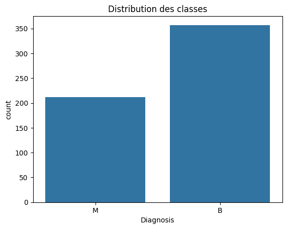
    


# **1.2 Statistiques descriptives**
# Analyse descriptive détaillée
**Statistiques globales :**
Classe B (Bénigne) : 357 occurrences
Classe M (Maligne) : 212 occurrences

**Analyse de la Répartition**

L'analyse met en évidence un déséquilibre important entre les deux classes : la classe B (Bénigne) représente environ 63 % des données, tandis que la classe M (Maligne) en constitue environ 37 %. Ce déséquilibre risque d'affecter les performances des algorithmes de classification en introduisant un biais en faveur de la classe majoritaire (B), au détriment de la classe minoritaire (M).

Faut-il rééquilibrer les classes ?

Oui, il est nécessaire d'adopter des méthodes de rééquilibrage pour garantir de meilleures performances des algorithmes sur les deux classes. Nous proposons d'utiliser l'approche du sur-échantillonnage (Oversampling), qui consiste à augmenter artificiellement la proportion de la classe minoritaire (M). Pour ce faire, nous utiliserons la technique SMOTE (Synthetic Minority Oversampling Technique), qui génère de nouveaux échantillons synthétiques à partir des données existantes de la classe minoritaire.


```python
print(data.describe())
```

             radius_1   texture_1  perimeter_1       area_1  smoothness_1  \
    count  569.000000  569.000000   569.000000   569.000000    569.000000   
    mean    14.127292   19.289649    91.969033   654.889104      0.096360   
    std      3.524049    4.301036    24.298981   351.914129      0.014064   
    min      6.981000    9.710000    43.790000   143.500000      0.052630   
    25%     11.700000   16.170000    75.170000   420.300000      0.086370   
    50%     13.370000   18.840000    86.240000   551.100000      0.095870   
    75%     15.780000   21.800000   104.100000   782.700000      0.105300   
    max     28.110000   39.280000   188.500000  2501.000000      0.163400   
    
           compactness_1  concavity_1  concave_points_1  symmetry_1  \
    count     569.000000   569.000000        569.000000  569.000000   
    mean        0.104341     0.088799          0.048919    0.181162   
    std         0.052813     0.079720          0.038803    0.027414   
    min         0.019380     0.000000          0.000000    0.106000   
    25%         0.064920     0.029560          0.020310    0.161900   
    50%         0.092630     0.061540          0.033500    0.179200   
    75%         0.130400     0.130700          0.074000    0.195700   
    max         0.345400     0.426800          0.201200    0.304000   
    
           fractal_dimension_1  ...    radius_3   texture_3  perimeter_3  \
    count           569.000000  ...  569.000000  569.000000   569.000000   
    mean              0.062798  ...   16.269190   25.677223   107.261213   
    std               0.007060  ...    4.833242    6.146258    33.602542   
    min               0.049960  ...    7.930000   12.020000    50.410000   
    25%               0.057700  ...   13.010000   21.080000    84.110000   
    50%               0.061540  ...   14.970000   25.410000    97.660000   
    75%               0.066120  ...   18.790000   29.720000   125.400000   
    max               0.097440  ...   36.040000   49.540000   251.200000   
    
                area_3  smoothness_3  compactness_3  concavity_3  \
    count   569.000000    569.000000     569.000000   569.000000   
    mean    880.583128      0.132369       0.254265     0.272188   
    std     569.356993      0.022832       0.157336     0.208624   
    min     185.200000      0.071170       0.027290     0.000000   
    25%     515.300000      0.116600       0.147200     0.114500   
    50%     686.500000      0.131300       0.211900     0.226700   
    75%    1084.000000      0.146000       0.339100     0.382900   
    max    4254.000000      0.222600       1.058000     1.252000   
    
           concave_points_3  symmetry_3  fractal_dimension_3  
    count        569.000000  569.000000           569.000000  
    mean           0.114606    0.290076             0.083946  
    std            0.065732    0.061867             0.018061  
    min            0.000000    0.156500             0.055040  
    25%            0.064930    0.250400             0.071460  
    50%            0.099930    0.282200             0.080040  
    75%            0.161400    0.317900             0.092080  
    max            0.291000    0.663800             0.207500  
    
    [8 rows x 30 columns]


# Analyse des Statistiques Descriptives

## Tendances Centrales (Moyenne, Médiane, 50%)
L'analyse des statistiques descriptives montre des tendances distinctes entre les différentes variables. Les variables à valeurs élevées : **Texture**, **périmètre** et **aire** présentent des moyennes nettement plus élevées que d'autres variables. Cela s'explique par le fait que ces variables mesurent des propriétés physiques globales et de grande échelle des tumeurs. Par exemple, **area_1** mesure des surfaces tumorales, avec une moyenne élevée en raison des tailles variées des tumeurs, tandis que **perimeter_1** capture la taille du contour des tumeurs, d'où des valeurs élevées par nature. Les variables à faibles valeurs : **Smoothness**, **compactness** et **concavity** ont des moyennes proches de zéro, ce qui suggère que ces variables sont sur une échelle plus fine. Elles capturent des propriétés relatives ou normalisées des tumeurs, comme la régularité, la compacité et la concavité des contours. Ces caractéristiques, bien que petites en valeur absolue, peuvent aussi être cruciales pour distinguer des tumeurs bénignes de malignes.

## Variabilité (Écart-Type - std)
L'analyse de la variabilité des données révèle des différences importantes entre les variables. Celles avec forte variabilité présentent des écarts-types élevés, indiquant une grande dispersion autour de la moyenne (**area_1** : écart-type = 351.91, **perimeter_1** : écart-type = 24.30). Les variables avec faible variabilité, comme **fractal_dimension_1**, **smoothness** ou **compactness**, présentent des écarts-types très faibles. Cela signifie que ces variables ont une distribution étroite autour de leur moyenne, ce qui témoigne d'une faible variabilité dans leurs valeurs.

## Comparaison des Séries (1, 2, 3)
Les caractéristiques des trois séries (1, 2, 3) montrent des tendances similaires en termes de moyennes et d'écarts-types. Cela suggère que chaque série représente des sous-groupes ou des angles d'analyse similaires des mêmes variables. Par exemple, **radius_1**, **radius_2** et **radius_3** mesurent probablement la même propriété (le rayon de la tumeur) mais sous des conditions ou des méthodes d'observation légèrement différentes.


# **1.3 Visualisation des données et corrélations**


```python
# Corrélations entre variables
corr = data.iloc[:, 1:].corr()
plt.figure(figsize=(10, 10))
sns.heatmap(corr, cmap="coolwarm", annot=False)
plt.title("Matrice de corrélation")
plt.show()
```


    
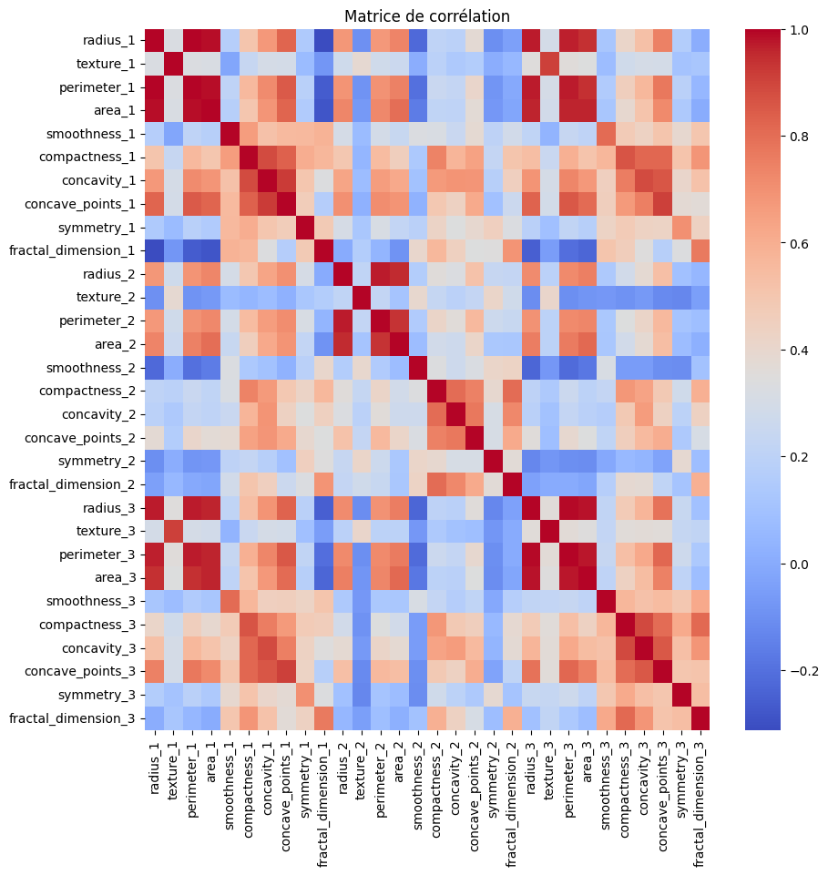
    


On observe une forte corrélation entre les variables d'un même type au sein des séries (1, 2, 3), ainsi qu’entre les variables
**périmètre**, **rayon (radius)** et **aire (area)**. Cela s’explique par le fait que ces variables capturent des aspects étroitement liés des tumeurs. En effet, les colonnes associées à chaque variable montrent des valeurs très similaires, ce qui révèle une certaine redondance dans les données.

Par conséquent, l’analyse approfondie sera limitée aux 10 premières variables pour éviter toute surabondance inutile


```python
# Etude poussée sur les correlation
#Calcule des corrélations entre les 10 premières caractéristiques.
feature = list(data.columns[1:11])
```


```python

# Calcule de la matrice de corrélation
correlationData = data[feature].corr()

# Visualisation avec une heatmap
plt.figure(figsize=(10, 8))
sns.heatmap(correlationData, annot=True, cmap='coolwarm', fmt='.2f')
plt.title("Matrice de corrélation entre les variables")
plt.show()

```


    
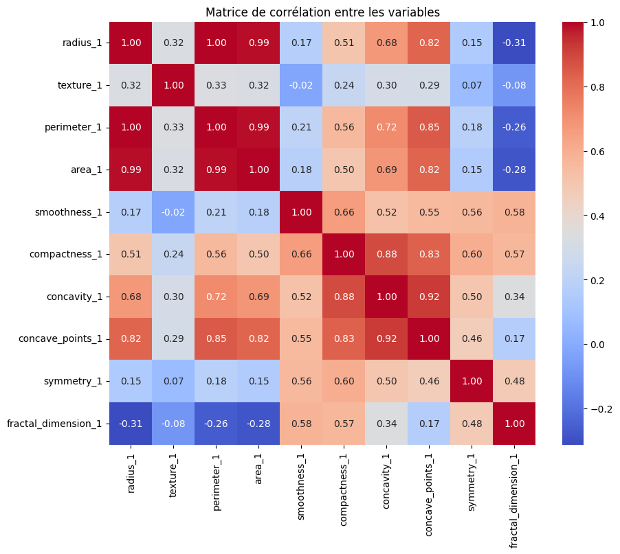
    


**Corrélations fortes (positives et négatives)**

Les corrélations positives fortes concernent principalement les variables **radius_1**, **perimeter_1** et **area_1**, qui affichent des corrélations très élevées (proches de 1). Cela suggère qu'elles mesurent des propriétés similaires des tumeurs, notamment des aspects liés à leur taille ou à leurs dimensions globales.  

En revanche, **fractal_dimension_1** montre une corrélation négative avec les variables globales telles que **radius**, **area** ou **perimeter**. Cette variable semble donc fournir une information complémentaire et non redondante, ce qui pourrait la rendre particulièrement utile pour la classification des tumeurs.

Pour la suite, nous allons visualiser certaines mesures telles que **radius**, **texture**, **concavity** et **fractal_dimension** afin de comprendre leurs distributions et leurs relations avec la variable cible **Diagnosis**. Observons leurs histogrammes et les distributions associées par classe.


```python

import seaborn as sns
import matplotlib.pyplot as plt

# les histogrammes pour une variable clé
sns.histplot(data=data, x="radius_1", hue="Diagnosis", kde=True, palette="coolwarm")
plt.title("Distribution de radius_1 par classe")
plt.show()


```


    
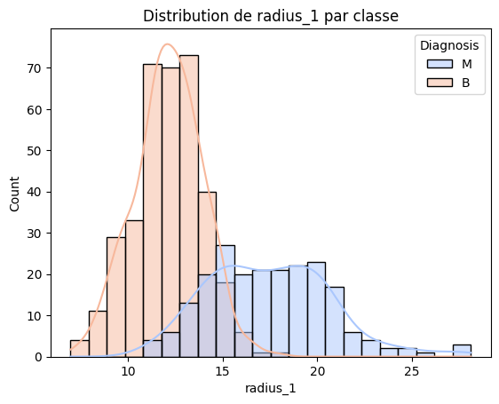
    


Pour la classe bénigne, la distribution de la variable **radius** tend à être centrée autour de valeurs plus faibles, tandis que pour la classe maligne, la distribution est déplacée vers des valeurs plus élevées, indiquant que les tumeurs malignes ont souvent un radius plus grand que les tumeurs bénignes.

Cela suggère que le **radius** est une variable discriminante importante pour séparer les deux classes.


```python
import seaborn as sns
import matplotlib.pyplot as plt

# les histogrammes pour une variable clé
sns.histplot(data=data, x="texture_1", hue="Diagnosis", kde=True, palette="coolwarm")
plt.title("Distribution de texture_1 par classe")
plt.show()
```


    
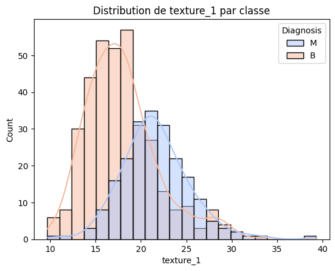
    


La variable **texture** montre des distributions qui se chevauchent entre les classes bénignes et malignes. Il est observé que la classe maligne (M) présente des valeurs de texture plus élevées en moyenne. Bien que **texture** soit une variable utile pour différencier les deux classes, **radius** s'avère être plus discriminante.


```python
import seaborn as sns
import matplotlib.pyplot as plt

# Tracer les histogrammes pour une variable clé
sns.histplot(data=data, x="concavity_1", hue="Diagnosis", kde=True, palette="coolwarm")
plt.title("Distribution de concavity_1 par classe")
plt.show()
```


    
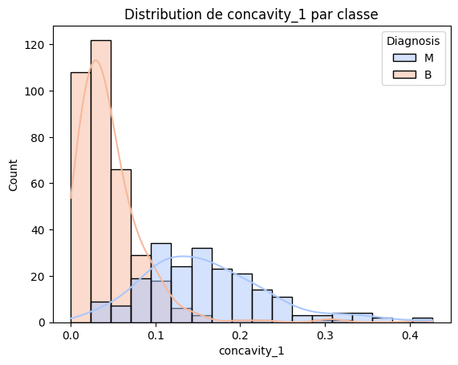
    


Pour la classe bénigne (B), la **concavité** est faible et centrée autour de valeurs proches de zéro, tandis que pour la classe maligne (M), on observe une plus grande dispersion vers des valeurs plus élevées, ce qui indique que les tumeurs malignes présentent souvent une **concavité** plus marquée.

Cette variable joue un rôle significatif dans la classification.


```python
import seaborn as sns
import matplotlib.pyplot as plt

# Tracer les histogrammes pour une variable clé
sns.histplot(data=data, x="fractal_dimension_1", hue="Diagnosis", kde=True, palette="coolwarm")
plt.title("Distribution de fractal_dimension_1 par classe")
plt.show()
```


    
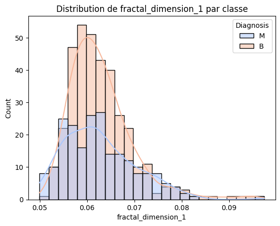
    


La distribution de **fractal_dimension_1** présente des chevauchements importants entre les classes bénignes et malignes, mais on remarque que la classe maligne (M) tend à avoir des valeurs plus élevées. Cela indique que, bien que **fractal_dimension_1** ne soit pas une variable aussi discriminante que **radius**, elle conserve néanmoins un certain pouvoir informatif pour différencier les tumeurs.

**Interprétation globlal**:
Les histogrammes montrent que certaines variables, comme **radius** et **concavity**, présentent des différences nettes entre les classes, tandis que d'autres, comme **texture** et **fractal_dimension**, ont des distributions plus proches mais restent informatives.

Ces visualisations confirment que :  

- Les tumeurs malignes tendent à avoir des valeurs plus élevées pour des variables comme **radius** et **concavity**.  
- La dispersion des valeurs est plus grande pour les tumeurs malignes, ce qui traduit une plus grande variabilité dans les mesures.  

Traçons des pairplots pour observer les relations entre les 10 variables et leur impact sur la classification.


```python
# Pairplot des premières variables
sns.pairplot(data, vars=["radius_1", "texture_1", "perimeter_1", "area_1", "smoothness_1", "compactness_1",
    "concavity_1", "concave_points_1", "symmetry_1", "fractal_dimension_1"], hue="Diagnosis", palette="coolwarm")
plt.show()

```


    
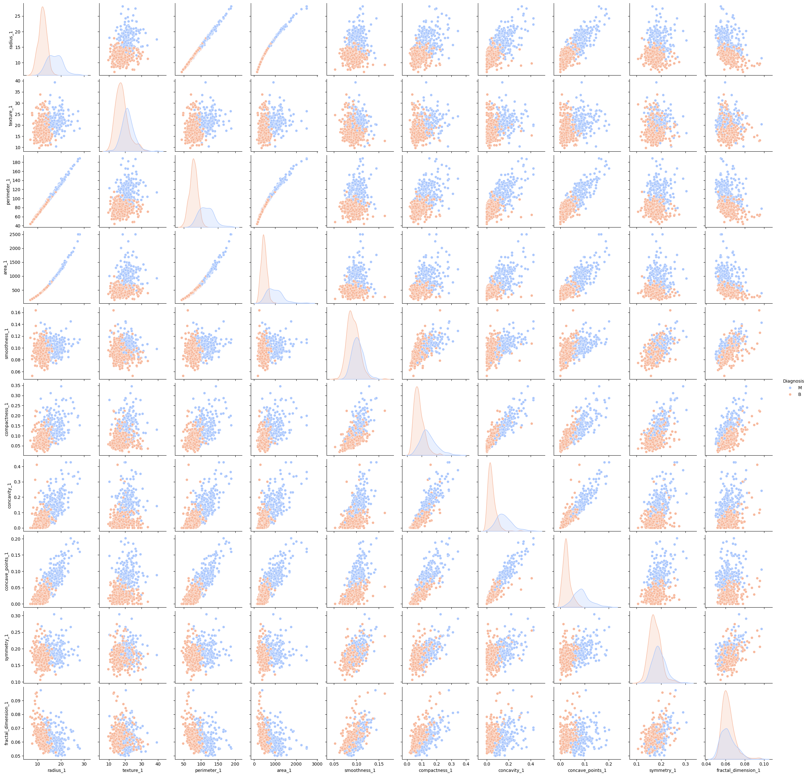
    


On observe qu'une forte augmentation des variables **radius**, **perimeter** et **area** tend à favoriser la présence de la classe M. Ces variables restent très corrélées.


# Conclusion
L’analyse de la matrice de corrélation révèle plusieurs points clés : une redondance importante entre des variables fortement corrélées (comme **radius**, **perimeter**, **area**) nécessite une réduction de dimensionnalité via des techniques telles que la PCA. Les variables faiblement corrélées, telles que **fractal_dimension** ou **smoothness**, présentent un potentiel discriminant élevé et doivent être conservées pour enrichir l’information utilisée dans les modèles de classification. Pour la suite, dans le cadre de la classification, nous allons utiliser une combinaison de réduction de dimension et de sélection de variables pertinentes afin de maximiser la performance des algorithmes de classification.


# **2. Algorithmes de classification**
# **2.1 Préparation des données**
2.1.1 **Division des données** :
On sépare les données en train (70%) et test (30%).*

2.1.2 **Prétraitement des données** :
Avant d' appliquer les algorithme , les données seront centré et normalisé .


```python
from sklearn.model_selection import train_test_split
from sklearn.preprocessing import StandardScaler, LabelEncoder

# Conversion de la variable cible
le = LabelEncoder()
data['Diagnosis'] = le.fit_transform(data['Diagnosis'])

# Séparation des données
X = data.drop('Diagnosis', axis=1)
y = data['Diagnosis']

X_train, X_test, y_train, y_test = train_test_split(X, y, test_size=0.3, stratify=y, random_state=42)

# Normalisation des données
scaler = StandardScaler()
X_train = scaler.fit_transform(X_train)
X_test = scaler.transform(X_test)

```

# **2.2 Implémentation des algorithmes**
**1. Régression logistique**:
C'est un modèle linéaire simple pour les problèmes de classification binaire (M ou B). Nous utiliserons la validation croisée pour ajuster les paramètres.


Tout d'abord, nous appliquerons l'algorithme de régression logistique sur nos données déséquilibrées afin d'observer l'impact de l'équilibrage des classes.

Ensuite, nous utiliserons l'Analyse en Composantes Principales (ACP) pour éliminer les variables redondantes, puis nous rééquilibrerons les classes. Nous appliquerons ensuite la régression logistique sur ces données transformées pour démontrer que le nouveau jeu de données offre de meilleurs résultats.

Enfin, nous testerons d'autres méthodes de classification sur les données projetées et comparerons leurs performances à l'aide de critères spécifiques.


```python
from sklearn.linear_model import LogisticRegression
from sklearn.metrics import classification_report, roc_auc_score, confusion_matrix

# Modèle de régression logistique
log_reg = LogisticRegression(random_state=42)
log_reg.fit(X_train, y_train)

# Prédictions
y_pred = log_reg.predict(X_test)
y_prob = log_reg.predict_proba(X_test)[:, 1]

# Évaluation
print("Matrice de confusion :\n", confusion_matrix(y_test, y_pred))
print("Rapport de classification :\n", classification_report(y_test, y_pred))
print("AUC :", roc_auc_score(y_test, y_prob))
```

    Matrice de confusion :
     [[106   1]
     [  4  60]]
    Rapport de classification :
                   precision    recall  f1-score   support
    
               0       0.96      0.99      0.98       107
               1       0.98      0.94      0.96        64
    
        accuracy                           0.97       171
       macro avg       0.97      0.96      0.97       171
    weighted avg       0.97      0.97      0.97       171
    
    AUC : 0.997517523364486


**Régression logistique**

La régression logistique s'est montrée très efficace avec un AUC de 0.9975 et une excellente capacité de discrimination, avec un faible nombre de faux positifs (1) et de faux négatifs (4).

Nous obtenons une précision de 0.96 pour la classe bénigne et 0.98 pour la classe maligne. La régression logistique est particulièrement efficace pour prédire la classe maligne.

Nous allons appliquer la régression logistique à nos données, mais cette fois après réduction de la dimension (ACP).


```python
from sklearn.decomposition import PCA
import matplotlib.pyplot as plt
import numpy as np

# Appliquer la PCA
pca = PCA(n_components=6)  # Laisser PCA calculer toutes les composantes
X_train_pca = pca.fit_transform(X_train)
X_test_pca = pca.transform(X_test)
# Visualiser la variance expliquée
plt.figure(figsize=(8, 5))
plt.plot(np.cumsum(pca.explained_variance_ratio_), marker='o', linestyle='--')
plt.xlabel('Nombre de composantes principales')
plt.ylabel('Variance expliquée cumulée')
plt.title('Variance expliquée par la PCA')
plt.show()
```


    
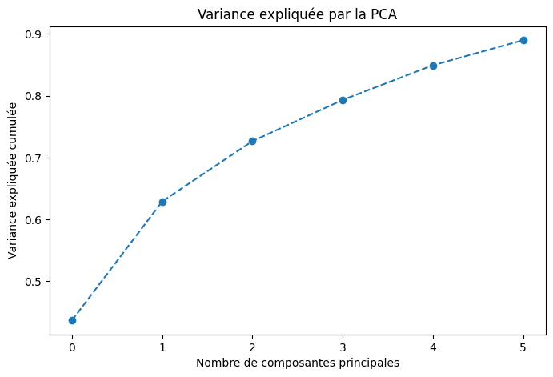
    


À partir de ce graphique, nous observons que 6 composantes principales sont nécessaires pour expliquer 90 à 95 % de la variance.

Utilisons les projections des données d'entraînement et de test dans l'espace défini par les 6 premières composantes principales.


```python
# Modèle de régression logistique
log_reg = LogisticRegression(random_state=42)
log_reg.fit(X_train_pca, y_train)

# Prédictions
y_pred = log_reg.predict(X_test_pca)
y_prob = log_reg.predict_proba(X_test_pca)[:, 1]

# Évaluation
print("Matrice de confusion :\n", confusion_matrix(y_test, y_pred))
print("Rapport de classification :\n", classification_report(y_test, y_pred))
print("AUC :", roc_auc_score(y_test, y_prob))
#plot de la courbe roc


```

    Matrice de confusion :
     [[106   1]
     [  2  62]]
    Rapport de classification :
                   precision    recall  f1-score   support
    
               0       0.98      0.99      0.99       107
               1       0.98      0.97      0.98        64
    
        accuracy                           0.98       171
       macro avg       0.98      0.98      0.98       171
    weighted avg       0.98      0.98      0.98       171
    
    AUC : 0.9982476635514018


On observe ici un AUC de 0.99824, ce qui est encore mieux qu'auparavant.

Équilibrons les données :


```python
from sklearn.ensemble import RandomForestClassifier
from sklearn.metrics import classification_report, roc_auc_score
from imblearn.over_sampling import SMOTE
# Rééquilibrage des données d'entraînement avec SMOTE
smote = SMOTE(random_state=42)
X_train_resampled, y_train_resampled = smote.fit_resample(X_train_pca, y_train)

# Modèle de régression logistique
log_reg = LogisticRegression(random_state=42)
log_reg.fit(X_train_resampled, y_train_resampled)

# Prédictions
y_pred = log_reg.predict(X_test_pca)
y_prob = log_reg.predict_proba(X_test_pca)[:, 1]

# Évaluation
print("Matrice de confusion :\n", confusion_matrix(y_test, y_pred))
print("Rapport de classification :\n", classification_report(y_test, y_pred))
print("AUC :", roc_auc_score(y_test, y_prob))
from sklearn.metrics import roc_curve
fpr, tpr, thresholds = roc_curve(y_test, y_prob)
plt.figure()
plt.plot([0, 1], [0, 1], 'k--')
plt.plot(fpr, tpr, label='Modèle')
plt.xlabel('Taux de faux positifs')
plt.ylabel('Taux de vrais positifs')
plt.legend(loc="lower right")
plt.title('Courbe ROC')
plt.legend()
plt.show()

```

    /usr/local/lib/python3.10/dist-packages/sklearn/base.py:474: FutureWarning: `BaseEstimator._validate_data` is deprecated in 1.6 and will be removed in 1.7. Use `sklearn.utils.validation.validate_data` instead. This function becomes public and is part of the scikit-learn developer API.
      warnings.warn(
    /usr/local/lib/python3.10/dist-packages/sklearn/utils/_tags.py:354: FutureWarning: The SMOTE or classes from which it inherits use `_get_tags` and `_more_tags`. Please define the `__sklearn_tags__` method, or inherit from `sklearn.base.BaseEstimator` and/or other appropriate mixins such as `sklearn.base.TransformerMixin`, `sklearn.base.ClassifierMixin`, `sklearn.base.RegressorMixin`, and `sklearn.base.OutlierMixin`. From scikit-learn 1.7, not defining `__sklearn_tags__` will raise an error.
      warnings.warn(


    Matrice de confusion :
     [[104   3]
     [  2  62]]
    Rapport de classification :
                   precision    recall  f1-score   support
    
               0       0.98      0.97      0.98       107
               1       0.95      0.97      0.96        64
    
        accuracy                           0.97       171
       macro avg       0.97      0.97      0.97       171
    weighted avg       0.97      0.97      0.97       171
    
    AUC : 0.997517523364486


    
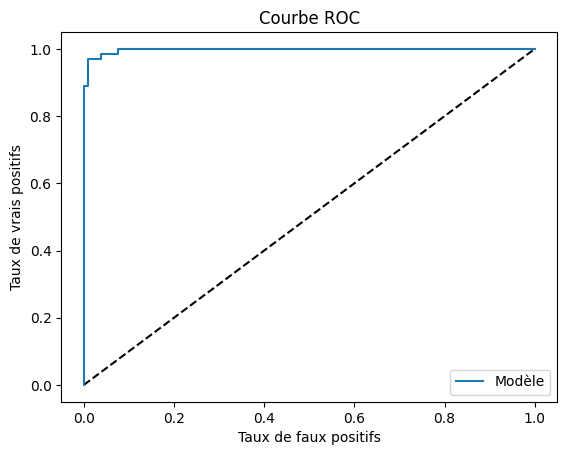
    


L'équilibre des classes n'a pas eu un grand effet sur notre modèle de régression logistique.

Nous allons utiliser les données projetées et rééquilibrées dans toutes les méthodes de classifications pour comparer nos modèles.

**2. LDA (Linear Discriminant Analysis)**

LDA est adapté aux situations où les classes sont bien séparées et suivent des distributions gaussiennes. Il ne nécessite aucune calibration.

**3. QDA (Quadratic Discriminant Analysis)**
    


```python
from sklearn.discriminant_analysis import LinearDiscriminantAnalysis, QuadraticDiscriminantAnalysis
# Modèle de discrimination linéaire
lda = LinearDiscriminantAnalysis()
lda.fit(X_train_resampled, y_train_resampled)
# Modèle de discrimination quadratique
qda = QuadraticDiscriminantAnalysis()
qda.fit(X_train_resampled, y_train_resampled)
lda_pred = lda.predict(X_test_pca)
qda_pred = qda.predict(X_test_pca)
# Évaluation
print("Matrice de confusion LDA :\n", confusion_matrix(y_test, lda_pred))
print("Rapport de classification LDA :\n", classification_report(y_test, lda_pred))
print("Matrice de confusion QDA :\n", confusion_matrix(y_test, qda_pred))
print("Rapport de classification QDA :\n", classification_report(y_test, qda_pred))
print("AUC LDA :", roc_auc_score(y_test, lda_pred))
print("AUC QDA :", roc_auc_score(y_test, qda_pred))
```

    Matrice de confusion LDA :
     [[107   0]
     [  6  58]]
    Rapport de classification LDA :
                   precision    recall  f1-score   support
    
               0       0.95      1.00      0.97       107
               1       1.00      0.91      0.95        64
    
        accuracy                           0.96       171
       macro avg       0.97      0.95      0.96       171
    weighted avg       0.97      0.96      0.96       171
    
    Matrice de confusion QDA :
     [[104   3]
     [  3  61]]
    Rapport de classification QDA :
                   precision    recall  f1-score   support
    
               0       0.97      0.97      0.97       107
               1       0.95      0.95      0.95        64
    
        accuracy                           0.96       171
       macro avg       0.96      0.96      0.96       171
    weighted avg       0.96      0.96      0.96       171
    
    AUC LDA : 0.953125
    AUC QDA : 0.962543808411215


```python
(y_test == lda_pred).mean()
```


    0.9649122807017544


```python
(y_test == qda_pred).mean()
```


    0.9649122807017544


**L'analyse discriminante linéaire (LDA)** a bien fonctionné pour les données équilibrées, offrant une précision parfaite pour la classe bénigne. Cependant, elle a montré ses limites pour la classe maligne, avec un rappel réduit (91 %) et 6 faux négatifs. Avec une AUC de 0.9531, cette méthode reste performante, mais elle est impactée par le déséquilibre des classes.

**L'analyse discriminante quadratique (QDA)** a offert des résultats équilibrés entre précision et rappel, avec une bonne performance globale. Elle a obtenu une précision de 97 % pour les tumeurs bénignes et de 95 % pour les tumeurs malignes, avec une AUC de 0.9625. QDA a ainsi démontré sa capacité à gérer des relations non linéaires.

**4. Méthode des forêts aléatoires**

La méthode des forêts aléatoires, basée sur des arbres de décision aléatoires, offre une classification efficace tout en gérant de manière optimale les interactions entre les variables.

Pour optimiser notre modèle, nous utiliserons la validation croisée avec GridSearchCV afin de déterminer les meilleurs hyperparamètres, notamment le nombre d'arbres (n_estimators) et la profondeur maximale (max_depth).


```python
from sklearn.ensemble import RandomForestClassifier
from sklearn.model_selection import GridSearchCV
#X_train_resampled, y_train_resampled
# Paramètres pour la grille
param_grid = {'n_estimators': [100, 200, 300], 'max_depth': [5, 10, 20]}
grid_rf = GridSearchCV(RandomForestClassifier(random_state=42), param_grid, cv=5, scoring='accuracy')
grid_rf.fit(X_train_resampled, y_train_resampled)

# Meilleurs paramètres
print("Meilleurs paramètres :\n", grid_rf.best_params_)
```

    Meilleurs paramètres :
     {'max_depth': 5, 'n_estimators': 100}


```python
# foret aléatoire avec les paramètre optimal
grid_rf = RandomForestClassifier(n_estimators=100, max_depth=5, random_state=42)
grid_rf.fit(X_train_resampled, y_train_resampled)
# matrice de confusion
from sklearn.metrics import confusion_matrix
y_pred = grid_rf.predict(X_test_pca)
print("Matrice de confusion :\n", confusion_matrix(y_test, y_pred))
# rapport de classification
from sklearn.metrics import classification_report
print("Rapport de classification :\n", classification_report(y_test, y_pred))
# AUC
from sklearn.metrics import roc_auc_score
y_prob = grid_rf.predict_proba(X_test_pca)[:, 1]
print("AUC :", roc_auc_score(y_test, y_prob))


```

    Matrice de confusion :
     [[103   4]
     [  5  59]]
    Rapport de classification :
                   precision    recall  f1-score   support
    
               0       0.95      0.96      0.96       107
               1       0.94      0.92      0.93        64
    
        accuracy                           0.95       171
       macro avg       0.95      0.94      0.94       171
    weighted avg       0.95      0.95      0.95       171
    
    AUC : 0.9940128504672897


```python
# Pour le bagginclassifier
from sklearn.ensemble import BaggingClassifier
from sklearn.tree import DecisionTreeClassifier
from sklearn.model_selection import GridSearchCV
# Modèle de bagging
bagging = BaggingClassifier(estimator=DecisionTreeClassifier(random_state=42), random_state=42)
param_grid = {'n_estimators': [10, 20, 30], 'max_samples': [0.5, 0.7, 0.9]}
grid_bagging = GridSearchCV(bagging, param_grid, cv=5, scoring='accuracy')
grid_bagging.fit(X_train_resampled, y_train_resampled)

```


<style>#sk-container-id-1 {
  /* Definition of color scheme common for light and dark mode */
  --sklearn-color-text: #000;
  --sklearn-color-text-muted: #666;
  --sklearn-color-line: gray;
  /* Definition of color scheme for unfitted estimators */
  --sklearn-color-unfitted-level-0: #fff5e6;
  --sklearn-color-unfitted-level-1: #f6e4d2;
  --sklearn-color-unfitted-level-2: #ffe0b3;
  --sklearn-color-unfitted-level-3: chocolate;
  /* Definition of color scheme for fitted estimators */
  --sklearn-color-fitted-level-0: #f0f8ff;
  --sklearn-color-fitted-level-1: #d4ebff;
  --sklearn-color-fitted-level-2: #b3dbfd;
  --sklearn-color-fitted-level-3: cornflowerblue;

  /* Specific color for light theme */
  --sklearn-color-text-on-default-background: var(--sg-text-color, var(--theme-code-foreground, var(--jp-content-font-color1, black)));
  --sklearn-color-background: var(--sg-background-color, var(--theme-background, var(--jp-layout-color0, white)));
  --sklearn-color-border-box: var(--sg-text-color, var(--theme-code-foreground, var(--jp-content-font-color1, black)));
  --sklearn-color-icon: #696969;

  @media (prefers-color-scheme: dark) {
    /* Redefinition of color scheme for dark theme */
    --sklearn-color-text-on-default-background: var(--sg-text-color, var(--theme-code-foreground, var(--jp-content-font-color1, white)));
    --sklearn-color-background: var(--sg-background-color, var(--theme-background, var(--jp-layout-color0, #111)));
    --sklearn-color-border-box: var(--sg-text-color, var(--theme-code-foreground, var(--jp-content-font-color1, white)));
    --sklearn-color-icon: #878787;
  }
}

#sk-container-id-1 {
  color: var(--sklearn-color-text);
}

#sk-container-id-1 pre {
  padding: 0;
}

#sk-container-id-1 input.sk-hidden--visually {
  border: 0;
  clip: rect(1px 1px 1px 1px);
  clip: rect(1px, 1px, 1px, 1px);
  height: 1px;
  margin: -1px;
  overflow: hidden;
  padding: 0;
  position: absolute;
  width: 1px;
}

#sk-container-id-1 div.sk-dashed-wrapped {
  border: 1px dashed var(--sklearn-color-line);
  margin: 0 0.4em 0.5em 0.4em;
  box-sizing: border-box;
  padding-bottom: 0.4em;
  background-color: var(--sklearn-color-background);
}

#sk-container-id-1 div.sk-container {
  /* jupyter's `normalize.less` sets `[hidden] { display: none; }`
     but bootstrap.min.css set `[hidden] { display: none !important; }`
     so we also need the `!important` here to be able to override the
     default hidden behavior on the sphinx rendered scikit-learn.org.
     See: https://github.com/scikit-learn/scikit-learn/issues/21755 */
  display: inline-block !important;
  position: relative;
}

#sk-container-id-1 div.sk-text-repr-fallback {
  display: none;
}

div.sk-parallel-item,
div.sk-serial,
div.sk-item {
  /* draw centered vertical line to link estimators */
  background-image: linear-gradient(var(--sklearn-color-text-on-default-background), var(--sklearn-color-text-on-default-background));
  background-size: 2px 100%;
  background-repeat: no-repeat;
  background-position: center center;
}

/* Parallel-specific style estimator block */

#sk-container-id-1 div.sk-parallel-item::after {
  content: "";
  width: 100%;
  border-bottom: 2px solid var(--sklearn-color-text-on-default-background);
  flex-grow: 1;
}

#sk-container-id-1 div.sk-parallel {
  display: flex;
  align-items: stretch;
  justify-content: center;
  background-color: var(--sklearn-color-background);
  position: relative;
}

#sk-container-id-1 div.sk-parallel-item {
  display: flex;
  flex-direction: column;
}

#sk-container-id-1 div.sk-parallel-item:first-child::after {
  align-self: flex-end;
  width: 50%;
}

#sk-container-id-1 div.sk-parallel-item:last-child::after {
  align-self: flex-start;
  width: 50%;
}

#sk-container-id-1 div.sk-parallel-item:only-child::after {
  width: 0;
}

/* Serial-specific style estimator block */

#sk-container-id-1 div.sk-serial {
  display: flex;
  flex-direction: column;
  align-items: center;
  background-color: var(--sklearn-color-background);
  padding-right: 1em;
  padding-left: 1em;
}


/* Toggleable style: style used for estimator/Pipeline/ColumnTransformer box that is
clickable and can be expanded/collapsed.
- Pipeline and ColumnTransformer use this feature and define the default style
- Estimators will overwrite some part of the style using the `sk-estimator` class
*/

/* Pipeline and ColumnTransformer style (default) */

#sk-container-id-1 div.sk-toggleable {
  /* Default theme specific background. It is overwritten whether we have a
  specific estimator or a Pipeline/ColumnTransformer */
  background-color: var(--sklearn-color-background);
}

/* Toggleable label */
#sk-container-id-1 label.sk-toggleable__label {
  cursor: pointer;
  display: flex;
  width: 100%;
  margin-bottom: 0;
  padding: 0.5em;
  box-sizing: border-box;
  text-align: center;
  align-items: start;
  justify-content: space-between;
  gap: 0.5em;
}

#sk-container-id-1 label.sk-toggleable__label .caption {
  font-size: 0.6rem;
  font-weight: lighter;
  color: var(--sklearn-color-text-muted);
}

#sk-container-id-1 label.sk-toggleable__label-arrow:before {
  /* Arrow on the left of the label */
  content: "▸";
  float: left;
  margin-right: 0.25em;
  color: var(--sklearn-color-icon);
}

#sk-container-id-1 label.sk-toggleable__label-arrow:hover:before {
  color: var(--sklearn-color-text);
}

/* Toggleable content - dropdown */

#sk-container-id-1 div.sk-toggleable__content {
  max-height: 0;
  max-width: 0;
  overflow: hidden;
  text-align: left;
  /* unfitted */
  background-color: var(--sklearn-color-unfitted-level-0);
}

#sk-container-id-1 div.sk-toggleable__content.fitted {
  /* fitted */
  background-color: var(--sklearn-color-fitted-level-0);
}

#sk-container-id-1 div.sk-toggleable__content pre {
  margin: 0.2em;
  border-radius: 0.25em;
  color: var(--sklearn-color-text);
  /* unfitted */
  background-color: var(--sklearn-color-unfitted-level-0);
}

#sk-container-id-1 div.sk-toggleable__content.fitted pre {
  /* unfitted */
  background-color: var(--sklearn-color-fitted-level-0);
}

#sk-container-id-1 input.sk-toggleable__control:checked~div.sk-toggleable__content {
  /* Expand drop-down */
  max-height: 200px;
  max-width: 100%;
  overflow: auto;
}

#sk-container-id-1 input.sk-toggleable__control:checked~label.sk-toggleable__label-arrow:before {
  content: "▾";
}

/* Pipeline/ColumnTransformer-specific style */

#sk-container-id-1 div.sk-label input.sk-toggleable__control:checked~label.sk-toggleable__label {
  color: var(--sklearn-color-text);
  background-color: var(--sklearn-color-unfitted-level-2);
}

#sk-container-id-1 div.sk-label.fitted input.sk-toggleable__control:checked~label.sk-toggleable__label {
  background-color: var(--sklearn-color-fitted-level-2);
}

/* Estimator-specific style */

/* Colorize estimator box */
#sk-container-id-1 div.sk-estimator input.sk-toggleable__control:checked~label.sk-toggleable__label {
  /* unfitted */
  background-color: var(--sklearn-color-unfitted-level-2);
}

#sk-container-id-1 div.sk-estimator.fitted input.sk-toggleable__control:checked~label.sk-toggleable__label {
  /* fitted */
  background-color: var(--sklearn-color-fitted-level-2);
}

#sk-container-id-1 div.sk-label label.sk-toggleable__label,
#sk-container-id-1 div.sk-label label {
  /* The background is the default theme color */
  color: var(--sklearn-color-text-on-default-background);
}

/* On hover, darken the color of the background */
#sk-container-id-1 div.sk-label:hover label.sk-toggleable__label {
  color: var(--sklearn-color-text);
  background-color: var(--sklearn-color-unfitted-level-2);
}

/* Label box, darken color on hover, fitted */
#sk-container-id-1 div.sk-label.fitted:hover label.sk-toggleable__label.fitted {
  color: var(--sklearn-color-text);
  background-color: var(--sklearn-color-fitted-level-2);
}

/* Estimator label */

#sk-container-id-1 div.sk-label label {
  font-family: monospace;
  font-weight: bold;
  display: inline-block;
  line-height: 1.2em;
}

#sk-container-id-1 div.sk-label-container {
  text-align: center;
}

/* Estimator-specific */
#sk-container-id-1 div.sk-estimator {
  font-family: monospace;
  border: 1px dotted var(--sklearn-color-border-box);
  border-radius: 0.25em;
  box-sizing: border-box;
  margin-bottom: 0.5em;
  /* unfitted */
  background-color: var(--sklearn-color-unfitted-level-0);
}

#sk-container-id-1 div.sk-estimator.fitted {
  /* fitted */
  background-color: var(--sklearn-color-fitted-level-0);
}

/* on hover */
#sk-container-id-1 div.sk-estimator:hover {
  /* unfitted */
  background-color: var(--sklearn-color-unfitted-level-2);
}

#sk-container-id-1 div.sk-estimator.fitted:hover {
  /* fitted */
  background-color: var(--sklearn-color-fitted-level-2);
}

/* Specification for estimator info (e.g. "i" and "?") */

/* Common style for "i" and "?" */

.sk-estimator-doc-link,
a:link.sk-estimator-doc-link,
a:visited.sk-estimator-doc-link {
  float: right;
  font-size: smaller;
  line-height: 1em;
  font-family: monospace;
  background-color: var(--sklearn-color-background);
  border-radius: 1em;
  height: 1em;
  width: 1em;
  text-decoration: none !important;
  margin-left: 0.5em;
  text-align: center;
  /* unfitted */
  border: var(--sklearn-color-unfitted-level-1) 1pt solid;
  color: var(--sklearn-color-unfitted-level-1);
}

.sk-estimator-doc-link.fitted,
a:link.sk-estimator-doc-link.fitted,
a:visited.sk-estimator-doc-link.fitted {
  /* fitted */
  border: var(--sklearn-color-fitted-level-1) 1pt solid;
  color: var(--sklearn-color-fitted-level-1);
}

/* On hover */
div.sk-estimator:hover .sk-estimator-doc-link:hover,
.sk-estimator-doc-link:hover,
div.sk-label-container:hover .sk-estimator-doc-link:hover,
.sk-estimator-doc-link:hover {
  /* unfitted */
  background-color: var(--sklearn-color-unfitted-level-3);
  color: var(--sklearn-color-background);
  text-decoration: none;
}

div.sk-estimator.fitted:hover .sk-estimator-doc-link.fitted:hover,
.sk-estimator-doc-link.fitted:hover,
div.sk-label-container:hover .sk-estimator-doc-link.fitted:hover,
.sk-estimator-doc-link.fitted:hover {
  /* fitted */
  background-color: var(--sklearn-color-fitted-level-3);
  color: var(--sklearn-color-background);
  text-decoration: none;
}

/* Span, style for the box shown on hovering the info icon */
.sk-estimator-doc-link span {
  display: none;
  z-index: 9999;
  position: relative;
  font-weight: normal;
  right: .2ex;
  padding: .5ex;
  margin: .5ex;
  width: min-content;
  min-width: 20ex;
  max-width: 50ex;
  color: var(--sklearn-color-text);
  box-shadow: 2pt 2pt 4pt #999;
  /* unfitted */
  background: var(--sklearn-color-unfitted-level-0);
  border: .5pt solid var(--sklearn-color-unfitted-level-3);
}

.sk-estimator-doc-link.fitted span {
  /* fitted */
  background: var(--sklearn-color-fitted-level-0);
  border: var(--sklearn-color-fitted-level-3);
}

.sk-estimator-doc-link:hover span {
  display: block;
}

/* "?"-specific style due to the `<a>` HTML tag */

#sk-container-id-1 a.estimator_doc_link {
  float: right;
  font-size: 1rem;
  line-height: 1em;
  font-family: monospace;
  background-color: var(--sklearn-color-background);
  border-radius: 1rem;
  height: 1rem;
  width: 1rem;
  text-decoration: none;
  /* unfitted */
  color: var(--sklearn-color-unfitted-level-1);
  border: var(--sklearn-color-unfitted-level-1) 1pt solid;
}

#sk-container-id-1 a.estimator_doc_link.fitted {
  /* fitted */
  border: var(--sklearn-color-fitted-level-1) 1pt solid;
  color: var(--sklearn-color-fitted-level-1);
}

/* On hover */
#sk-container-id-1 a.estimator_doc_link:hover {
  /* unfitted */
  background-color: var(--sklearn-color-unfitted-level-3);
  color: var(--sklearn-color-background);
  text-decoration: none;
}

#sk-container-id-1 a.estimator_doc_link.fitted:hover {
  /* fitted */
  background-color: var(--sklearn-color-fitted-level-3);
}
</style><div id="sk-container-id-1" class="sk-top-container"><div class="sk-text-repr-fallback"><pre>GridSearchCV(cv=5,
             estimator=BaggingClassifier(estimator=DecisionTreeClassifier(random_state=42),
                                         random_state=42),
             param_grid={&#x27;max_samples&#x27;: [0.5, 0.7, 0.9],
                         &#x27;n_estimators&#x27;: [10, 20, 30]},
             scoring=&#x27;accuracy&#x27;)</pre><b>In a Jupyter environment, please rerun this cell to show the HTML representation or trust the notebook. <br />On GitHub, the HTML representation is unable to render, please try loading this page with nbviewer.org.</b></div><div class="sk-container" hidden><div class="sk-item sk-dashed-wrapped"><div class="sk-label-container"><div class="sk-label fitted sk-toggleable"><input class="sk-toggleable__control sk-hidden--visually" id="sk-estimator-id-1" type="checkbox" ><label for="sk-estimator-id-1" class="sk-toggleable__label fitted sk-toggleable__label-arrow"><div><div>GridSearchCV</div></div><div><a class="sk-estimator-doc-link fitted" rel="noreferrer" target="_blank" href="https://scikit-learn.org/1.6/modules/generated/sklearn.model_selection.GridSearchCV.html">?<span>Documentation for GridSearchCV</span></a><span class="sk-estimator-doc-link fitted">i<span>Fitted</span></span></div></label><div class="sk-toggleable__content fitted"><pre>GridSearchCV(cv=5,
             estimator=BaggingClassifier(estimator=DecisionTreeClassifier(random_state=42),
                                         random_state=42),
             param_grid={&#x27;max_samples&#x27;: [0.5, 0.7, 0.9],
                         &#x27;n_estimators&#x27;: [10, 20, 30]},
             scoring=&#x27;accuracy&#x27;)</pre></div> </div></div><div class="sk-parallel"><div class="sk-parallel-item"><div class="sk-item"><div class="sk-label-container"><div class="sk-label fitted sk-toggleable"><input class="sk-toggleable__control sk-hidden--visually" id="sk-estimator-id-2" type="checkbox" ><label for="sk-estimator-id-2" class="sk-toggleable__label fitted sk-toggleable__label-arrow"><div><div>best_estimator_: BaggingClassifier</div></div></label><div class="sk-toggleable__content fitted"><pre>BaggingClassifier(estimator=DecisionTreeClassifier(random_state=42),
                  max_samples=0.7, random_state=42)</pre></div> </div></div><div class="sk-serial"><div class="sk-item sk-dashed-wrapped"><div class="sk-parallel"><div class="sk-parallel-item"><div class="sk-item"><div class="sk-label-container"><div class="sk-label fitted sk-toggleable"><input class="sk-toggleable__control sk-hidden--visually" id="sk-estimator-id-3" type="checkbox" ><label for="sk-estimator-id-3" class="sk-toggleable__label fitted sk-toggleable__label-arrow"><div><div>estimator: DecisionTreeClassifier</div></div></label><div class="sk-toggleable__content fitted"><pre>DecisionTreeClassifier(random_state=42)</pre></div> </div></div><div class="sk-serial"><div class="sk-item"><div class="sk-estimator fitted sk-toggleable"><input class="sk-toggleable__control sk-hidden--visually" id="sk-estimator-id-4" type="checkbox" ><label for="sk-estimator-id-4" class="sk-toggleable__label fitted sk-toggleable__label-arrow"><div><div>DecisionTreeClassifier</div></div><div><a class="sk-estimator-doc-link fitted" rel="noreferrer" target="_blank" href="https://scikit-learn.org/1.6/modules/generated/sklearn.tree.DecisionTreeClassifier.html">?<span>Documentation for DecisionTreeClassifier</span></a></div></label><div class="sk-toggleable__content fitted"><pre>DecisionTreeClassifier(random_state=42)</pre></div> </div></div></div></div></div></div></div></div></div></div></div></div></div></div>


```python
# Meilleurs paramètres
print("Meilleurs paramètres :\n", grid_bagging.best_params_)

```

    Meilleurs paramètres :
     {'max_samples': 0.7, 'n_estimators': 10}


```python
# on execute avec les paramètres optimales
bagging = BaggingClassifier(estimator=DecisionTreeClassifier(random_state=42), n_estimators=10, max_samples=0.7, random_state=42)
bagging.fit(X_train_resampled, y_train_resampled)
print("Matrice de confusion :\n",sns.heatmap( confusion_matrix(y_test, y_pred), annot=True))
print("Rapport de classification :\n", classification_report(y_test, y_pred))
print("AUC :", roc_auc_score(y_test, y_prob))
```

    Matrice de confusion :
     Axes(0.125,0.11;0.62x0.77)
    Rapport de classification :
                   precision    recall  f1-score   support
    
               0       0.95      0.96      0.96       107
               1       0.94      0.92      0.93        64
    
        accuracy                           0.95       171
       macro avg       0.95      0.94      0.94       171
    weighted avg       0.95      0.95      0.95       171
    
    AUC : 0.9940128504672897


    
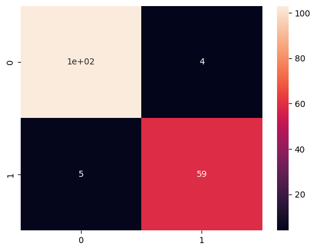
    


```python
# la courbe roc
fpr, tpr, thresholds = roc_curve(y_test, y_prob)
plt.figure()
plt.plot([0, 1], [0, 1], 'k--')
plt.plot(fpr, tpr, label='Modèle')
plt.xlabel('Taux de faux positifs')
plt.ylabel('Taux de vrais positifs')
plt.legend(loc="lower right")
plt.title('Courbe ROC')
plt.legend()
```


    <matplotlib.legend.Legend at 0x7834b631d030>


    
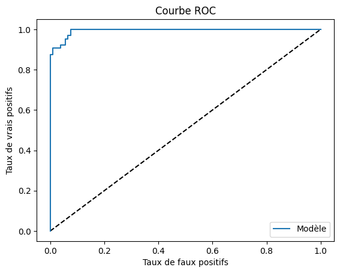
    


Les forêts aléatoires ont montré une très bonne performance globale grâce à leur robustesse face à la variance. Avec une précision de 95 % pour les deux classes et une AUC de 0.9940, elles démontrent une capacité équilibrée à classifier correctement les tumeurs bénignes et malignes, tout en gérant efficacement les interactions complexes entre les variables.

Nous allons ensuite utiliser la méthode **feature_importance**   des forêts aléatoires pour identifier les variables les plus influentes.


```python
# utilise la méthode feature importance des forêts aléatoires pour identifier les variables les plus influentes
importances = grid_rf.feature_importances_
indices = np.argsort(importances)[::-1]
# Affichage des 10 premières variables les plus importantes
print("Les 3 premières variables les plus importantes sont :")
for i in range(3):
    print(f"{i+1}. {X.columns[indices[i]]} ({importances[indices[i]]:.4f})")
```

    Les 3 premières variables les plus importantes sont :
    1. radius_1 (0.6653)
    2. texture_1 (0.1222)
    3. perimeter_1 (0.0741)


Nous voyons que **radius** est la variable la plus importante dans la classification, ce qui confirme l'analyse que nous avons faite dans la première partie.

**6. K-plus proches voisins (KNN)** : C'est une méthode simple basée sur la proximité des points. Pour le choix de K (nombre de voisins), nous utiliserons GridSearchCV pour déterminer le paramètre idéal et optimal.


```python
#Entraîner l’algorithme des k  plus proches voisin et évaluer sa qualité
#de classification sur les données test. on utilisera GridSearchCV pour le paramètre ideal
# des k.
from sklearn.neighbors import KNeighborsClassifier
from sklearn.model_selection import GridSearchCV
# Paramètres pour la grille
param_grid = {'n_neighbors': [1,3, 5, 7, 9,11,20]}
grid_knn = GridSearchCV(KNeighborsClassifier(), param_grid, cv=5, scoring='accuracy')
grid_knn.fit(X_train_resampled, y_train_resampled)
# Meilleurs paramètres
print("Meilleurs paramètres :\n", grid_knn.best_params_)


```

    Meilleurs paramètres :
     {'n_neighbors': 1}


```python
# entrainement avec k=3
knn = KNeighborsClassifier(n_neighbors=3)
knn.fit(X_train_resampled, y_train_resampled)
# matrice de confusion
y_pred = knn.predict(X_test_pca)
print("Matrice de confusion :\n", confusion_matrix(y_test, y_pred))
print("Rapport de classification :\n", classification_report(y_test, y_pred))
# AUC
y_prob = knn.predict_proba(X_test_pca)[:, 1]
print("AUC :", roc_auc_score(y_test, y_prob))

```

    Matrice de confusion :
     [[104   3]
     [  5  59]]
    Rapport de classification :
                   precision    recall  f1-score   support
    
               0       0.95      0.97      0.96       107
               1       0.95      0.92      0.94        64
    
        accuracy                           0.95       171
       macro avg       0.95      0.95      0.95       171
    weighted avg       0.95      0.95      0.95       171
    
    AUC : 0.9686769859813085


L’algorithme des k-plus proches voisins (KNN) a produit des résultats satisfaisants, avec une précision de 95% pour les deux classes et une AUC de 0.9687. Cependant, sa performance est légèrement inférieure à d’autres méthodes .

**7.SVM (Support Vector Machines)**


```python
# SVM
from sklearn.model_selection import GridSearchCV
from sklearn.svm import SVC
from sklearn.pipeline import make_pipeline

clf = GridSearchCV(SVC(gamma='auto'), param_grid={'C': [1, 5, 10, 50]}, cv=5)
clf.fit(X_train_resampled, y_train_resampled)
print("Meilleurs paramètres :\n", clf.best_params_)


```

    Meilleurs paramètres :
     {'C': 1}


```python
# test avec le meilleur partamètre
clf = SVC(C=1, gamma='auto')
clf.fit(X_train_resampled, y_train_resampled)
from sklearn.metrics import confusion_matrix
y_pred = clf.predict(X_test_pca)
print("Matrice de confusion :\n", confusion_matrix(y_test, y_pred))
print("Rapport de classification :\n", classification_report(y_test, y_pred))
print("AUC :", roc_auc_score(y_test, y_pred))
```

    Matrice de confusion :
     [[105   2]
     [  5  59]]
    Rapport de classification :
                   precision    recall  f1-score   support
    
               0       0.95      0.98      0.97       107
               1       0.97      0.92      0.94        64
    
        accuracy                           0.96       171
       macro avg       0.96      0.95      0.96       171
    weighted avg       0.96      0.96      0.96       171
    
    AUC : 0.9515917056074766


```python
print(clf.score(X_test_pca, y_test))
```

    0.9590643274853801


Le support vector machine (SVM) a montré de solides performances, en particulier pour des données bien séparables. Avec une précision de 95% pour les tumeurs bénignes et 97% pour les tumeurs malignes, et une AUC de 0.9515, SVM a démontré sa capacité à gérer des frontières complexes tout en maintenant un faible nombre d’erreurs.

## **2.3 Analyse globale des performances**

| **Algorithme**         | **Accuracy** | **AUC**   | **Classe bien classifiée** |
|-------------------------|--------------|-----------|----------------------------|
| Régression logistique  | 97%          | 0.9975    | Classe maligne             |
| LDA                   | 96%          | 0.9531    | Classe bénigne             |
| QDA                   | 96%          | 0.9625    | Équilibré                  |
| Forêts aléatoires     | 95%          | 0.9940    | Équilibré                  |
| KNN                   | 95%          | 0.9687    | Équilibré                  |
| SVM                   | 96%          | 0.9515    | Équilibré                  |


**Algorithme le plus adapté**

La **régression logistique** se distingue par son AUC élevé (0.9975) et sa capacité à bien classifier la classe maligne, ce qui est crucial dans un contexte médical. Elle combine simplicité, efficacité, et performance, en particulier sur des données linéairement séparables.
Les forêts aléatoires et QDA offrent des performances comparables, avec une capacité robuste à gérer des données complexes et des interactions non linéaires. Elles sont recommandées si des relations non linéaires sont présentes.

# **Conclusion Générale**

Dans ce projet, nous avons développé une solution robuste pour classifier les tumeurs bénignes et malignes à partir de données médicales. L'analyse descriptive a mis en évidence des variables discriminantes comme radius, area, et concave points, ainsi qu’un déséquilibre notable entre les classes, nécessitant une attention particulière lors de l’évaluation des modèles.

La régression logistique s’est révélée la méthode la plus performante, avec une AUC de 0.9975, combinant simplicité et fiabilité, en particulier pour prédire les tumeurs malignes. Les forêts aléatoires et QDA ont également offert de solides performances, adaptées à des données plus complexes.

Ce projet démontre l'importance d'une approche méthodique, combinant exploration des données et évaluation rigoureuse des modèles, pour répondre efficacement à des problématiques médicales critiques.
